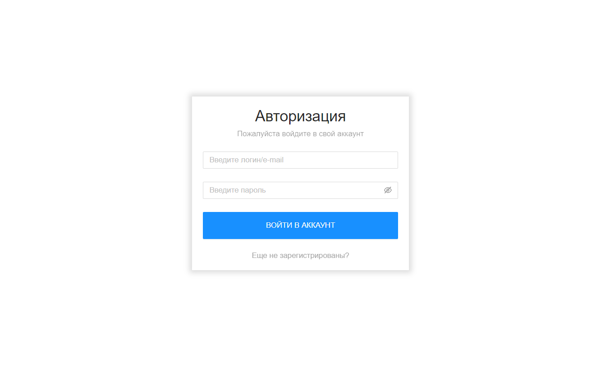
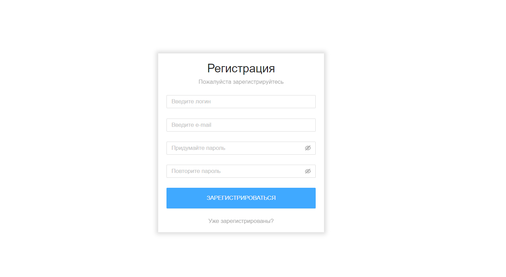
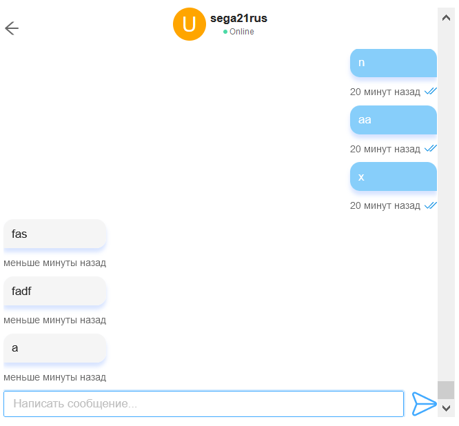

## AS Chat

This is an application for chatting between each other.

# Technology stack

Server

+ Express
+ Typescript for comfortable development
+ JWT (JSON Web Token) for authorization
+ Socket.io
+ Mongoose
+ Babel for import aliases 
+ Pkg for minification
+ Archiver for building archive with .exe file for production

Client

+ React
+ Typescript for comfortable development
+ date-fns for tranform dates
+ Scss for styles
+ Redux for global state
+ Redux-Thunk for async actions
+ Reselect for search/filter data from redux state
+ Socket.io-client
+ Ant-design

Deploy

+ Docker
+ Docker Compose

Linters 

+ EsLint
# Installation

Install all requirements for server and client.
```
npm run init
```

# Run
Run server.
```
npm run server
```
Run client.
```
npm run client
```

# Illustration






